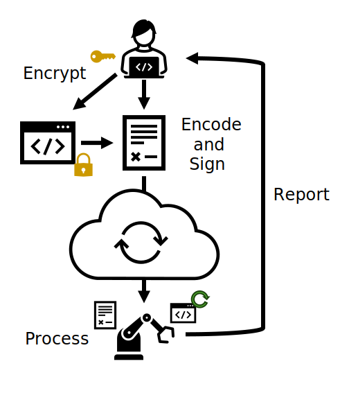

# [libcsuit](https://github.com/kentakayama/libcsuit/)



**libcsuit** is a C library for encoding and decoding [IETF SUIT manifests](https://datatracker.ietf.org/doc/html/draft-ietf-suit-manifest).
The manifest contains meta-data about the firmware image. The manifest is protected against modification and provides information
about the software/firmware author.

For more information on how the IETF SUIT manifest is used to protect firmware updates of IoT devices, please look at the
 [IETF SUIT architecture](https://datatracker.ietf.org/doc/html/rfc9019) document and the
 [IETF SUIT](https://datatracker.ietf.org/wg/suit/about/) working group.

Supported features are:
- Processing & Reporting: Parse and Execute a SUIT Manifest, and Generate a SUIT Report (see [examples/process](https://github.com/kentakayama/libcsuit/tree/master/examples/process))
- Parsing: Parse and Print a SUIT Manifest (see [examples/parser](https://github.com/kentakayama/libcsuit/tree/master/examples/parser))
- Signing Manifest: Sign/MAC a SUIT Manifest (see [examples/sign](https://github.com/kentakayama/libcsuit/tree/master/examples/sign))
- Encrypting & Decrypting a Payload: Encrypt a payload to generate a `SUIT_Encryption_Info` and ciphertext (see [examples/encrypt](https://github.com/kentakayama/libcsuit/tree/master/examples/encrypt))
- Encoding: Encode a (signed) SUIT Manifest (see [examples/encode](https://github.com/kentakayama/libcsuit/tree/master/examples/encode))

See [SUPPORTED.md](./SUPPORTED.md) for each supported fundamental functions.

For encoding and signing SUIT Manifests, try [suit-manifest-generator](https://github.com/kentakayama/suit-manifest-generator) which is much kind to human being.

Tested SUIT Manifests are found in [testfiles/README.md](./testfiles/README.md)

## Overview

This implementation uses
 - the [QCBOR](https://github.com/laurencelundblade/QCBOR) library for encoding and decoding CBOR structures,
 - the [t_cose](https://github.com/laurencelundblade/t_cose) library for cryptographic processing of COSE structures,
   - since the Pull Request [#293: Add fully specified algorithms](https://github.com/laurencelundblade/t_cose/pull/293) is not merged yet and [#158: Use Deterministic ECDSA](https://github.com/laurencelundblade/t_cose/pull/158) was rejected, [forked version](https://github.com/kentakayama/t_cose/tree/dev-deterministic-ecdsa) is used
 - OpenSSL or Mbed TLS (based on the PSA Crypto API) for cryptographic algorithms.

This implementation offers the functionality defined in
- [draft-ietf-suit-manifest-34](https://datatracker.ietf.org/doc/html/draft-ietf-suit-manifest-34)
- [draft-ietf-suit-trust-domains-12](https://datatracker.ietf.org/doc/html/draft-ietf-suit-trust-domains-12)
- [draft-ietf-suit-update-management-10](https://datatracker.ietf.org/doc/html/draft-ietf-suit-update-management-10)
- [draft-ietf-suit-firmware-encryption-26](https://datatracker.ietf.org/doc/html/draft-ietf-suit-firmware-encryption-26)
- [draft-ietf-suit-report-18](https://datatracker.ietf.org/doc/html/draft-ietf-suit-report-18)
- ~~[draft-ietf-suit-mud-10](https://datatracker.ietf.org/doc/html/draft-ietf-suit-mud-10)~~

Example programs are offered for testing.

## Getting started

```bash
git clone --recursive https://github.com/kentakayama/libcsuit
cd ./libcsuit
```
or
```bash
git clone https://github.com/kentakayama/libcsuit
cd ./libcsuit
git submodule update --init --recursive
```

We recommend option **(a)** and **(b)**, using docker not to modify your system.
The [process](./examples/process/) sample program is expected to be run on IoT devices and TEE environments.

**(a) Use OpenSSL**
```bash
docker build -t libcsuit_ossl -f ossl.Dockerfile .
docker run -t libcsuit_ossl ./examples/process/suit_manifest_process ./testfiles/suit_manifest_exp0.cbor
```

**(b) Use Mbed TLS**
```bash
docker build -t libcsuit_psa -f psa.Dockerfile .
docker run -t libcsuit_psa ./examples/process/suit_manifest_process ./testfiles/suit_manifest_exp0.cbor
```

**(c) Build and run natively**
```bash
make -C examples/process
./examples/process/suit_manifest_process ./testfiles/suit_maniefst_exp0.cbor
```
See [SUIT Manifest Example 0](./testfiles/suit_manifest_exp0.md) and [SUIT Manifest Processor's output](./misc/process_example0.txt).

If you want to install libcsuit to your system, see [INSTALL.md](INSTALL.md)

## License and Copyright
BSD 2-Clause License

Copyright (c) 2020-2023 SECOM CO., LTD. All Rights reserved.

Redistribution and use in source and binary forms, with or without
modification, are permitted provided that the following conditions are met:

1. Redistributions of source code must retain the above copyright notice, this
   list of conditions and the following disclaimer.

2. Redistributions in binary form must reproduce the above copyright notice,
   this list of conditions and the following disclaimer in the documentation
   and/or other materials provided with the distribution.

THIS SOFTWARE IS PROVIDED BY THE COPYRIGHT HOLDERS AND CONTRIBUTORS "AS IS"
AND ANY EXPRESS OR IMPLIED WARRANTIES, INCLUDING, BUT NOT LIMITED TO, THE
IMPLIED WARRANTIES OF MERCHANTABILITY AND FITNESS FOR A PARTICULAR PURPOSE ARE
DISCLAIMED. IN NO EVENT SHALL THE COPYRIGHT HOLDER OR CONTRIBUTORS BE LIABLE
FOR ANY DIRECT, INDIRECT, INCIDENTAL, SPECIAL, EXEMPLARY, OR CONSEQUENTIAL
DAMAGES (INCLUDING, BUT NOT LIMITED TO, PROCUREMENT OF SUBSTITUTE GOODS OR
SERVICES; LOSS OF USE, DATA, OR PROFITS; OR BUSINESS INTERRUPTION) HOWEVER
CAUSED AND ON ANY THEORY OF LIABILITY, WHETHER IN CONTRACT, STRICT LIABILITY,
OR TORT (INCLUDING NEGLIGENCE OR OTHERWISE) ARISING IN ANY WAY OUT OF THE USE
OF THIS SOFTWARE, EVEN IF ADVISED OF THE POSSIBILITY OF SUCH DAMAGE.
