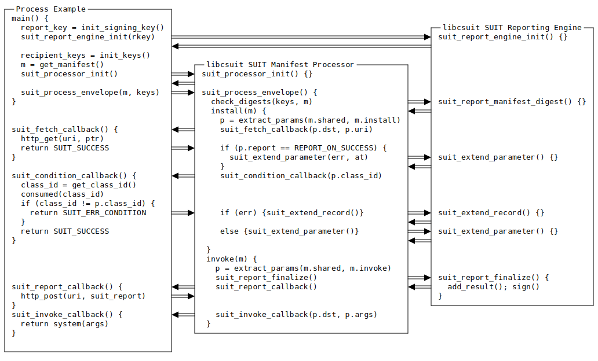
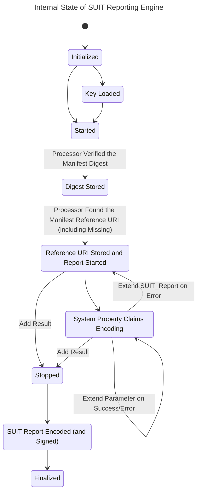

# libcsuit Process Example

SUIT Manifest Processor, which behavior is defined in [draft-ietf-suit-manifest](https://datatracker.ietf.org/doc/html/draft-ietf-suit-manifest-34#section-6), processes a SUIT Manifest.
It triggers SUIT Reporting Engine to generate a [SUIT Report](https://datatracker.ietf.org/doc/html/draft-ietf-suit-report) if it is initialized and set.



## Sample Code

The example program initializes libcsuit:

```c
    // Initialize SUIT Rerpoting Engine
    suit_report_init_engine(reporting_engine, REPORT_SIZE);
    suit_report_add_sender_key(reporting_engine, CBOR_TAG_COSE_SIGN1, T_COSE_ALGORITHM_RESERVED, &sender_key);
    UsefulBufC nonce = NULLUsefulBufC;
    suit_report_start_encoding(reporting_engine, nonce);

    // Initialize SUIT Manifest Processor
    UsefulBuf manifest_buf;
    bool report_invoke_pending = true;
    suit_processor_init(processor_context, BUFFER_SIZE, reporting_engine, report_invoke_pending, &manifest_buf);

    manifest_buf.len = read_from_file(argv[optind], manifest_buf.ptr, manifest_buf.len);

    // Set process flag: all sections excepting the suit-uninstall section
    suit_process_flag_t process_flags;
    process_flags.all = UINT16_MAX;
    process_flags.uninstall = 0;

    // Add SUIT Manifest
    suit_processor_add_manifest(processor_context, UsefulBuf_Const(manifest_buf), process_flags);

    // Assign the SUIT Manifest Signer's Public Key
    suit_processor_add_recipient_key(processor_context, CBOR_TAG_COSE_SIGN1, T_COSE_ALGORITHM_ES256, trust_anchor_esp256_cose_key_public);

    // Execute
    suit_process_envelope(processor_context);

    // Free resources
    suit_processor_free(processor_context);
    free(processor_context);
    free(reporting_engine);
```

## Callback Functions

SUIT Manifest Processor triggers some callback functions on most directives and conditions.
There are 7 callback functions for now, and each one prints the callback arguments by default.

```h
suit_err_t suit_fetch_callback(suit_fetch_args_t fetch_args, suit_callback_ret_t *fetch_ret);
suit_err_t suit_store_callback(suit_store_args_t store_args, suit_callback_ret_t *store_ret);
suit_err_t suit_invoke_callback(suit_invoke_args_t invoke_args);
suit_err_t suit_condition_callback(suit_condition_args_t condition_args, suit_callback_ret_t *ret);
suit_err_t suit_set_version_callback(suit_int64_array_t set_version);
suit_err_t suit_wait_callback(suit_wait_args_t wait_args);
suit_err_t suit_report_callback(suit_report_args_t report_args);
```

You can overwrite them with your own callback functions.
For example, the `-Xlinker --wrap=suit_condition_callback` linker option replaces the libcsuit-defined original callback function with `__real_suit_store_callback`, and calls `__wrap_suit_store_callback` if defined.
You can still call the original one with replaced function name.

```c
suit_err_t __real_suit_store_callback(suit_store_args_t store_args, suit_callback_ret_t *fetch_ret);
suit_err_t __wrap_suit_store_callback(suit_store_args_t store_args, suit_callback_ret_t *fetch_ret)
{
    // call original one
    suit_err_t result = __real_suit_store_callback(store_args, fetch_ret);
    if (result != SUIT_SUCCESS) {
        goto out;
    }

    // do anything
}
```

The following SUIT Manifest makes SUIT Manifest Processor triggering appropriate callbacks 6 times in total.
Note that the shared-sequence are commonly processed in every sections,

- suit-validate
  - `condition-callback({vendor-id: h'fa6b4a53d5ad5fdfbe9de663e4d41ffe'})` in shared-sequence
  - `condition-callback({class-id: h'1492af1425695e48bf429b2d51f2ab45'})` in shared-sequence
  - `condition-callback({image-size: 34768, image-digest: <<[-16,h'00112233445566778899aabbccddeeff0123456789abcdeffedcba9876543210']>>})` in suit-validate
- suit-invoke
  - `condition-callback({vendor-id: h'fa6b4a53d5ad5fdfbe9de663e4d41ffe'})` in shared-sequence
  - `condition-callback({class-id: h'1492af1425695e48bf429b2d51f2ab45'})` in shared-sequence
  - `invoke-callback({})` in suit-invoke

~~~~
/ SUIT_Envelope = / 107({
  / authentication-wrapper / 2: << [
    << [
      / digest-algorithm-id: / -16 / SHA256 /,
      / digest-bytes: / h'6658ea560262696dd1f13b782239a064da7c6c5cbaf52fded428a6fc83c7e5af'
    ] >>,
    << / COSE_Sign1_Tagged / 18([
      / protected: / << {
        / algorithm-id / 1: -9 / ESP256 /
      } >>,
      / unprotected: / {},
      / payload: / null,
      / signature: / h'8679a7bde316a9c8a7dd701f3f153f011368749fce6c12e4e2c9f704d3bd104fb77559d2d9723ac9ce550dc69e7bf8cc3a1a460dc6f2b851780bd23cf6669c29'
    ]) >>
  ] >>,
  / manifest / 3: << {
    / manifest-version / 1: 1,
    / manifest-sequence-number / 2: 0,
    / common / 3: << {
      / components / 2: [
        [h'00']
      ],
      / shared-sequence / 4: << [
        / directive-override-parameters / 20, {
          / vendor-id / 1: h'fa6b4a53d5ad5fdfbe9de663e4d41ffe' / fa6b4a53-d5ad-5fdf-be9d-e663e4d41ffe /,
          / class-id / 2: h'1492af1425695e48bf429b2d51f2ab45' / 1492af14-2569-5e48-bf42-9b2d51f2ab45 /,
          / image-digest / 3: << [
            / algorithm-id: / -16 / SHA-256 /,
            / digest-bytes: / h'00112233445566778899aabbccddeeff0123456789abcdeffedcba9876543210'
          ] >>,
          / image-size / 14: 34768
        },
        / condition-vendor-identifier / 1, 15, / TRIGGER condition-callback({vendor-id: h'fa6b4a53d5ad5fdfbe9de663e4d41ffe'}) /
        / condition-class-identifier / 2, 15 / TRIGGER condition-callback({class-id: h'1492af1425695e48bf429b2d51f2ab45'}) /
      ] >>
    } >>,
    / validate / 7: << [
      / shared-sequence are called here, triggering two conditions /
      / condition-image-match / 3, 15 / TRIGGER condition-callback({image-size: 34768, image-digest: <<[-16,h'00112233445566778899aabbccddeeff0123456789abcdeffedcba9876543210']>>}) /
    ] >>,
    / invoke / 9: << [
      / shared-sequence are called here, triggering two conditions /
      / directive-invoke / 23, 2 / TRIGGER invoke-callback({}) /
    ] >>
  } >>
})
~~~~

## SUIT Reporting Engine
SUIT Reporting Engine provides logging functionality for the Status Tracking Server.
If set, SUIT Manifest Processor extends the SUIT Report in appropriate timing while parsing.
The following charg describes the internal state of SUIT Reporting Engine, changed by the user code (for example, [suit_manifest_process_main.c](suit_manifest_process_main.c)) and libcsuit ([suit_manifest_process.c](https://github.com/kentakayama/libcsuit/blob/master/src/suit_manifest_process.c)).



After Finalizing the SUIT Report encoding, SUIT Manifest Processor triggers `suit_report_callback()`.
Like other callback functions, it can be also overwritten by your code.
The default callback function prints the (signed) SUIT Report:

```
    / COSE_Sign1_Tagged = / 18([
      / protected: / << {
        / alg / 1: -9 / ESP256 /
      } >>,
      / unprotected: / {
        / kid / 4: h'E96788B10B1610ABE478F9CE8DCFE2304C0911DD8CFEADDE25EC30CCB5A7B5AF'
      },
      / payload: / {
        / suit-reference / 99: [
          / suit-report-manifest-uri: / "",
          / suit-report-manifest-digest: / [
            / algorithm-id: / -16 / SHA-256 /,
            / digest-bytes: / h'6658EA560262696DD1F13B782239A064DA7C6C5CBAF52FDED428A6FC83C7E5AF'
          ]
        ],
        / suit-report-records / 3: [
          {
            / system-component-id / 0: [h'00'],
            / vendor-id / 1: h'FA6B4A53D5AD5FDFBE9DE663E4D41FFE',
            / class-id / 2: h'1492AF1425695E48BF429B2D51F2AB45',
            / image-size / 14: 34768,
            / vendor-id / 1: h'FA6B4A53D5AD5FDFBE9DE663E4D41FFE',
            / class-id / 2: h'1492AF1425695E48BF429B2D51F2AB45'
          }
        ],
        / suit-report-result / 4: true
      }
      / signatre: / h'5EFD96CE60E54889913FA0ADAACE337872ED15BF46099D410BBDF5A20EF00B2B1260771346515D996683F36936EA6D2C4932AF74E5BBD6E9E1BEE0C00B666B28'
    ])
```

You can control the timing when the `suit_report_callback()` function is triggered with the 4th argument of `suit_processor_init(processor_context, BUFFER_SIZE, reporting_engine, report_invoke_pending, &manifest_buf);`.
If true, SUIT Manifest Processor stops recording and triggers it just before the `suit-directive-invoke` with `suit-report-result-invoke-pending`, otherwise on finish processing the root manifest.
